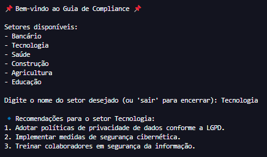

# 🧭 Ethical Practices Advisor (Compliance Recommender)

## 📚 Description

This is a simple command-line tool built in **Python** that provides compliance recommendations tailored to specific business sectors. It reads from a structured JSON file and allows users to interactively consult best practices for different industries. The project reflects the intersection between data, ethics, and automation — a core element of my background in law and corporate governance.

---

## 🛠️ Technologies Used

- Python
- JSON
- Basic file I/O
- CLI interaction (`input()`)

---

## 🚀 How to Run

```bash
# Clone the repository
git clone https://github.com/andre-maccarini/ethical-practices-advisor.git

# Navigate to the project folder
cd ethical-practices-advisor

# Make sure the 'data/' folder and 'compliance_data.json' file exist
# Run the application
python main.py
```

## 🎮 Preview



## 📁 Folder Structure

ethical-practices-advisor/
├── data/
│   └── compliance_data.json
├── main.py
└── README.md

## 🧠 What I Learned
How to read and parse JSON files in Python

How to design interactive command-line tools

How to modularize logic for data loading and presentation

How to combine domain expertise (compliance) with automation

## 📈 Possible Improvements
 Build a web-based version using Streamlit

 Allow dynamic updates to sectors and practices

 Add option to export recommendations to .txt or .pdf

 Translate interface to English for broader reach

## ✍️ Author
André Maccarini